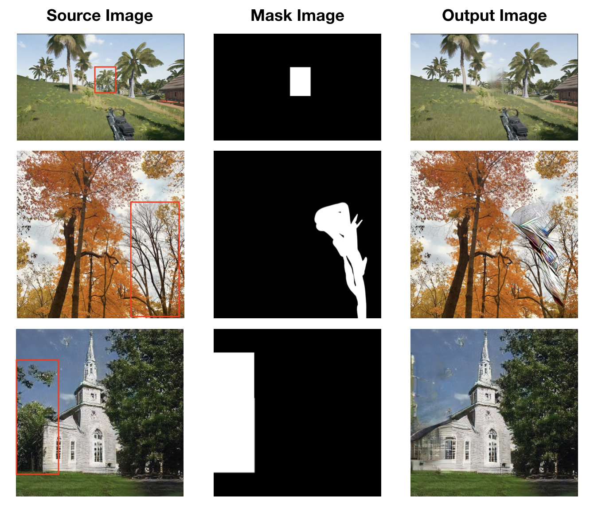
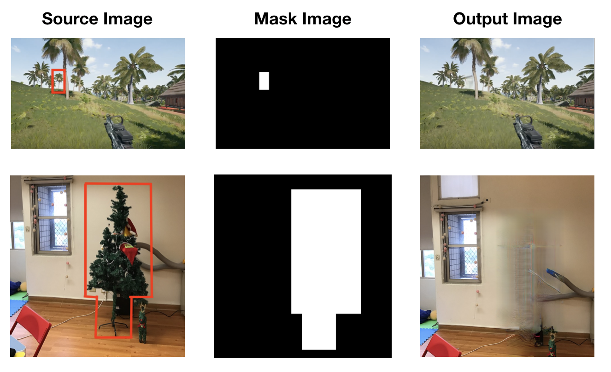

# Computer Vision for Visual Effects Homework 3 
**Team 7** 

## Outline
1. 動機與目的
1. Image generated by GANPaint  
2. Dissect GAN and analysis
3. Method 1: Pytorch Inpainting
4. Method 2: 
5. Overall comparison and conclusion

## 動機與目的

## Image generated by GANPaint

## Dissect GAN and analysis

## Method 1: Pytorch Inpainting

### 作法

### 結果

左中右排分別是source，mask跟output。source中標出的紅框就是我們想要去除的部份。

首先我們先試了三張圖。第一張圖的樹是在畫面中間，上面是天空，右手邊有一棵樹，但不算很貼近。可以看到結果裡，上半部消除的還不錯，但是下半部樹幹的部分看起來很雜亂，不合理。我們想也許是因為mask是正方形，框的範圍太大不夠精確，於是就有了第二張圖。第二張圖的樹在樹叢中間，但是是一棵沒有葉子的樹。這邊的mask是用筆刷塗，想說是不是圖的輪廓乾淨一點，他可以判斷的比較好。但是結果是，中間多出了比第一張更明顯的雜訊。於是我們又嘗試了第三張，想試試如果背景不是天空，去除的效果如何。結果圖中，它有意圖延伸屋頂的邊緣線，但是將樹抹去之後，還是很不自然。

所以對於樹的移除方面，我們認為他的效果只有在移除背景單一，且獨自存在的樹，才較為自然。所以我又做了兩個圖實驗，見下圖。

第一張的移除效果就還滿好的，遠點看就看不太出來。第二張沒那麼好，｀因為樹的範圍較大，背景（牆壁）卻很單一，不怎麼能提供足夠的填補資訊，所以才有那麼多雜訊。但是地板跟牆壁的交接處，是有分辨出分隔的，所以我們認為還可以接受。

## Method 2:

## Overall comparison and conclusion