# Computer Vision for Visual Effects Homework 3 
**Team 7** 

## Outline
1. 動機與目的
1. Image generated by GANPaint  
2. Dissect GAN and analysis
3. Method 1: Pytorch Inpainting - Globally and Locally Consistent Image Completion
4. Method 2: Image Inpainting for Irregular Holes Using Partial Convolutions
5. Overall comparison and conclusion

## 動機與目的
在全球暖化嚴重的的當今環境下，砍樹是極度政治不正確的選擇，但有時候實在會覺得有棵樹長得位置很不對，擋住了視線，那麼在不適合砍樹的這時候我們可以用影像處理的方式讓視野開闊。在這份報告中，我們要討論的是在影像中把樹移除的方法及其長處短處，其中我們會討論三種方法，GANPaint、Pytorch Inpainting及Partial Convolutions。另外，在討論GANPaint時會驗證一下就算改動了unit的值，GAN依舊會拒絕產出極度不合理的圖。

## Image generated by GANPaint

### 原理說明

#### 目標

GANPaint的出現其實不是為了讓人能產出任意的圖，而是為了要理解及視覺化GAN。在有工具能充分理解GAN的行為後，我們就可以回答以下問題：GAN需要學多少東西可以剛好夠產生一張教堂的圖片？GAN的output若是不如預期的話，那麼是什麼出錯了？為什麼GAN的某變形會比另一個好？而後就能設計出更符合需求的GAN。

#### 作法

*  分解GAN(下圖的a部分)
    
1. 找到是什麼讓output image有某class c
   
    令GAN的Generator G: z → x，z是個低維的vector；x是張三channel的圖。

    再令r是G某個特定layer的feature map output，則r可以表示成 r = h(z)，又x是由layers堆起來的，所以x可以表示成 x = f(r) = f(h(z)) = G(z)。

    由上面的式子可以看出，若x裡包含某個class c(例如樹)，那麼那這個概念一定存在在r裡，因為 x = f(r)。

2. 找出這個c是如何enocode在r裡面

    根據一篇CVPR 2017 David Bau 等人的paper，要定位object classes 在圖中的位置可以對unit做upsampling然後加上threshold。受此啟發，在convolution中，feature map的 h*w大多遠小於output resolution，因此把單個感興趣的unit中的feature map upsample到output resolution，然後threshold，這個新的feature map跟對class c做的segmentation(s_c(x))做Intersection-over-Union(IoU)。當IoU越大，則該unit就跟class c越有關。

    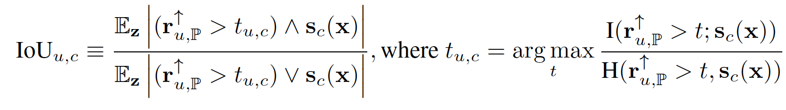

    小寫的u代表只看一個unit；s_c(x)是一個binary mask紀錄在output image x中class c所分布的地方（s for segmentation）。

    threshold必須得要有足夠意義，因此運用了一篇2017年Dedy Rahman Wijaya 等人的paper：最大化information quality ratio I/H。

* 操作特定感興趣的Units的feature map(下圖的b部分)
    
    圖中只是on/off感興趣的unit feature map值，但在延伸下去，我們可以調整feature map的值來嘗試增減generate出來的圖中的物體。

    Ablate東西就把units的值拉成0；Insert東西就把units的值變成k，而這個k是個個unit各異的常數。

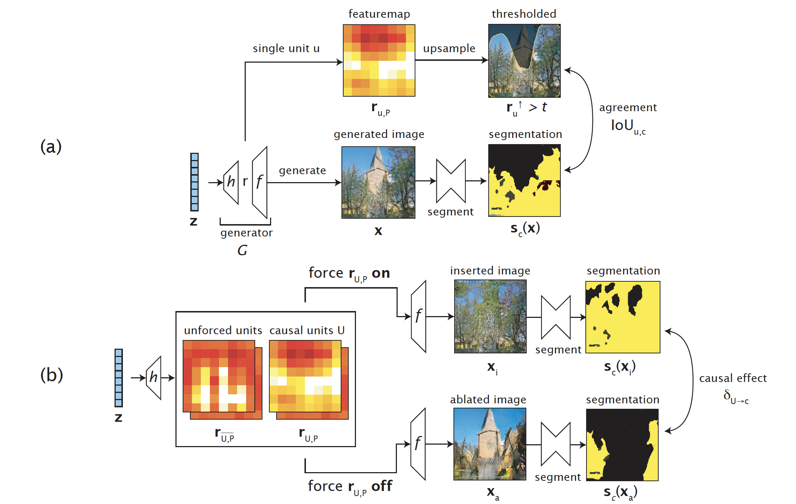

綜上所述，我們可以用分解GAN時算出來跟樹的IoU最大，也就是說跟樹最有關的units的feature maps拿出來，在我們想去掉樹的地方把這些feature map的地方填上0，那麼我們就可以預期model根據這些新的feature map產出的output image中應該會在那些地方少掉樹。

|Before|After|
|:---:|:---:|
|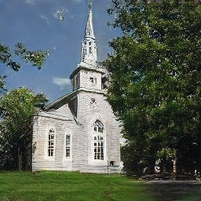|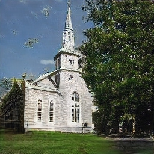|

我們移除了影像中左側的小樹，我們可以看到在移除掉樹的地方補上了個屋頂，乍看之下挺合理的，但再仔細一看會注意到屋簷有不合常理的突起。

## Dissect GAN and analysis

既然GANPaint是為了讓人理解GAN究竟學到什麼，那我們就來驗證一下是不是真的任意修改feature map後，output image並不會完全依照我們不一定合理的要求來改變影像的內容。以下我們做了四次實驗：

|結果圖|描述|
|:---:|---|
|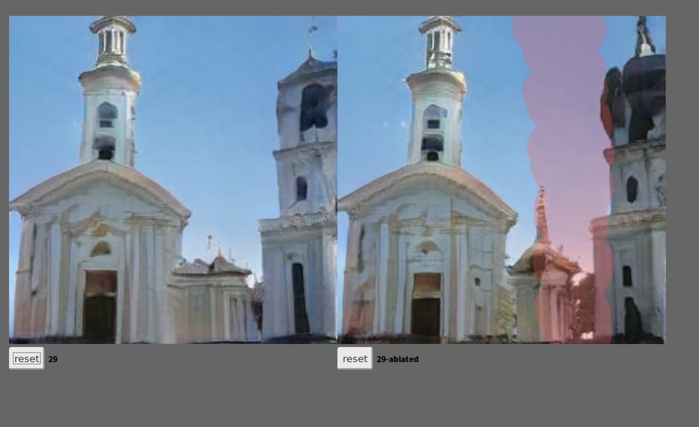|嘗試要長出一柱擎天的樹 失敗，只有地面上多出了一棵沒那麼高的樹， 還有被畫到的建築物變高了。|
|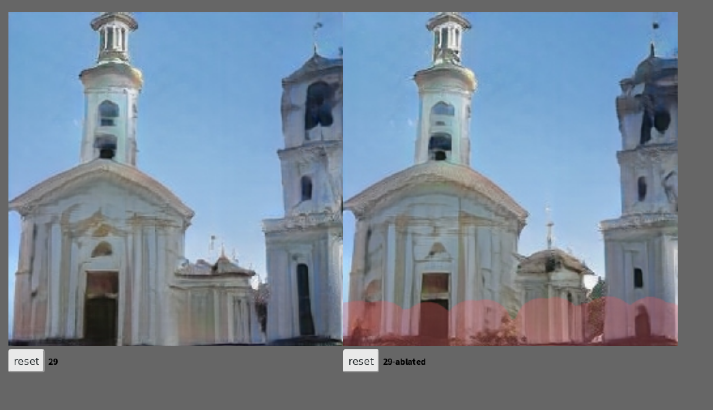|嘗試在地面上長出一排矮木 成功，雖然長出來的樹只有少少幾株， 但在這個很明顯是水泥地的環境的這張圖中， 以我的角度看來有太多樹也是不太合理的。|
|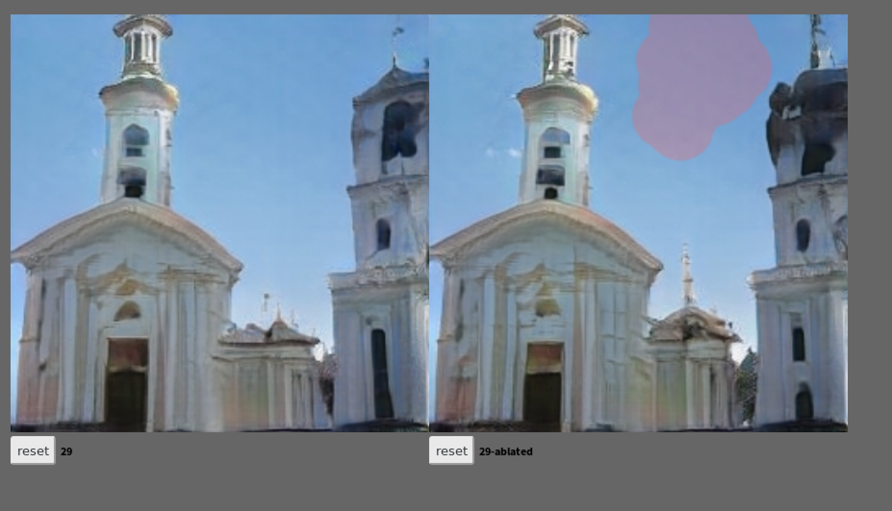|嘗試天外飛來一樹 失敗，而的確常識上來說天空並不會飄出一棵樹。|
|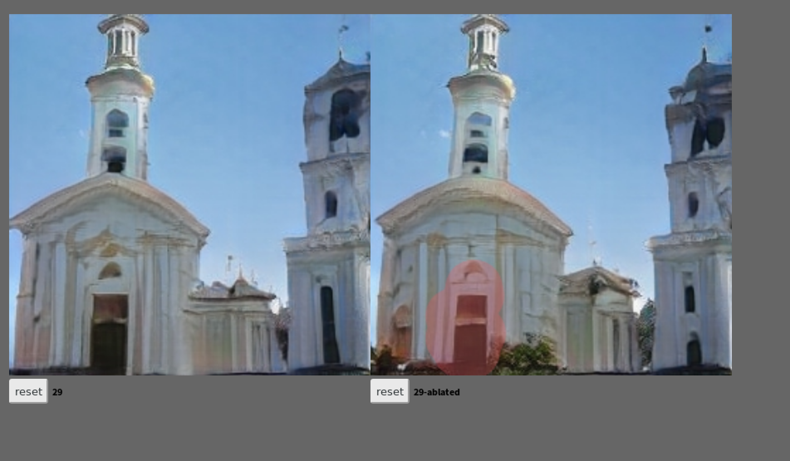|嘗試在正門口長一棵樹 失敗，但是在門口旁長出了樹。|

根據上面的實驗，我們可以看出不合理的要求：一柱擎天的樹及天外飛來一樹都沒有產出我們所預期的不合理影像，至於矮木，雖然在地面上畫了一排，終究是只有在一些避開門的地方長了兩三棵。最有趣的是最後一個實驗，當我們要求要在正門口長樹時，輸出的結果卻是在門的兩側長樹，推測是因為model學到對教堂來說門是很重要的特徵，於是在其他unit把門補回來，但把門補回來並不能解釋為何樹會長在我們要求的區域以外。

## Method 1: Pytorch Inpainting - Globally and Locally Consistent Image Completion

### 原理說明

#### 目標

Image completion大多需要對景象較細微與high-level的了解，因為除了要用填補附近的材質，還需要了解整個景象的結構與需要被填補的物品。過去diffused-based的inpainting方法大多只能填補較小或較窄的洞，patch-based的方法改善了diffused-based的問題，但是它依靠的是較low-level的feature，所以對於較複雜的結構效果還是不那麼好。而這個方法考量了整個景象local與global的連續性與組成，對隨機的區域都可以產生自然的填補，甚至可以產生原圖沒有的物品來填補空白。

#### 作法

整個network由三個部分組成：completion network，global context discriminator，local context discriminator。completion network是fully convolutional的，負責填補影像，而另外兩個discriminator是用來輔助，顧名思義global discriminator就是看整張圖片的一致性，local就是只看被填補範圍的附近區域，做更加細微的判斷。整個結構見下圖。

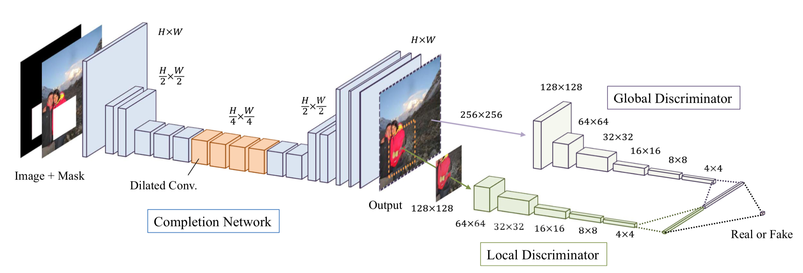  

**1. Completion Network** 
Completion Network是使用Convolution Neural Network，只是與傳統不同，使用的是dilated convolution layers。dilated convolution會將C-channel的HxW input擴充成C'-channel H'xW'。內部公式如下：  
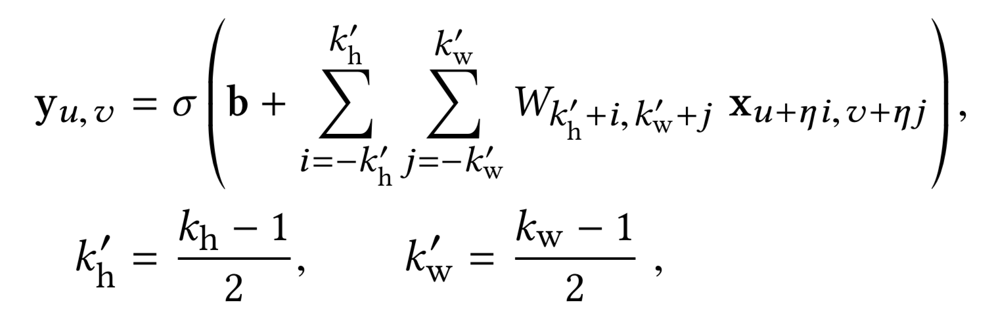

kw、kh是kernel的weight和height（必須是奇數以取中心）；η是擴充係數，當η=1即為一般的convolution；xu,v（C維）跟yu,v（C'維）分別是input跟output的pixel component，σ是component-wise的非線性函數，W是C'xC的矩陣，b是C'維的bias向量。train這些網絡是用back propagation做minimize loss function的更新，並且dataset是有一對input與output的。Loss function主要就是要最小化network output image跟dataset正確output image的距離。

為了節省空間，一開始會降低圖的解析度到256x256，這邊為了避免直接pooling會有的模糊情況，是用strided convolution降到1/4；之後再做deconvolution把它展回去。使用dilated convolution的優點是可以在低解析度上“看”到更大範圍的圖片，範圍大約是307x307px，如果不這麼做的話，只能看到99x99px，範圍太小會使得欲填補畫面中心的資訊太少導致無法正確重現畫面。

**2. Global & Local Discriminator**

這兩個Network構造大致一樣，都是依賴convolutional Neural Network把圖片壓縮成小的feature vectors，最後再用Fully connected展開成1024*2=2048維的vector再過sigmoid轉成[0,1]之間的值，判斷填補完的圖是真或是假。唯一的差別是Global的size是256x256，而Local是以被填補區域為中心的128x128，比global少一半，所以Network少一層。每層的stride都是2x2，以降低解析度。

### 結果

**實驗一：試三張不同mask的圖**

|Source Image|Mask Image|Output Image|
|:---:|:---:|:---:|
|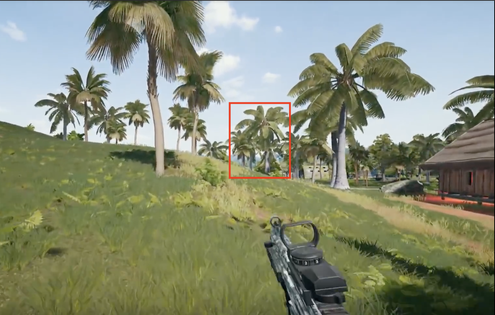|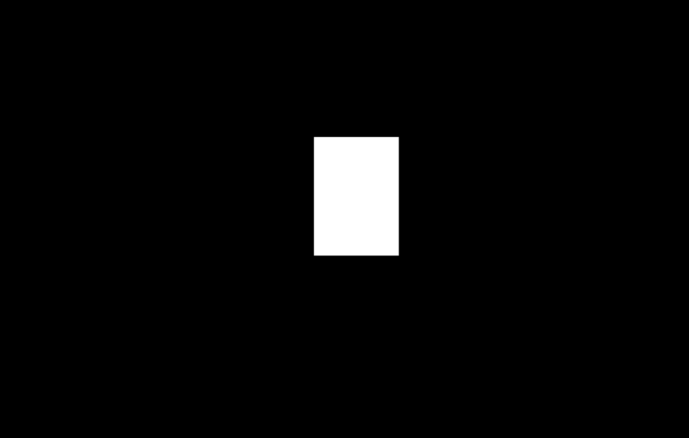|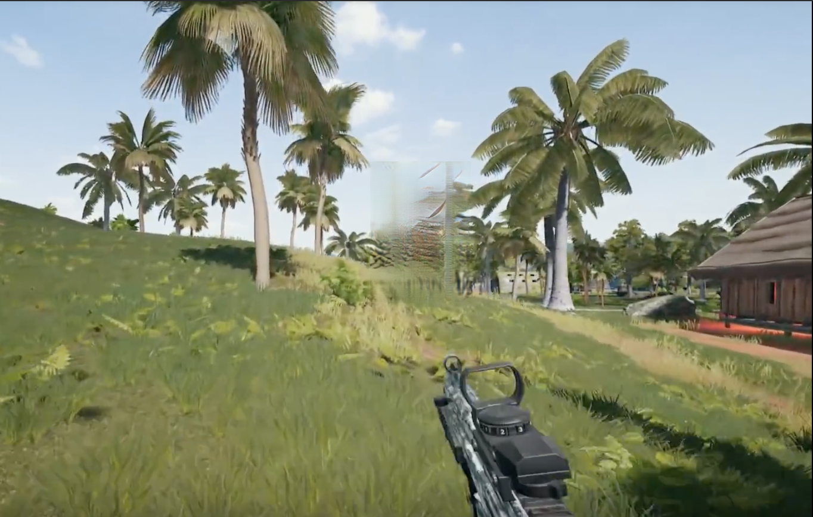|
|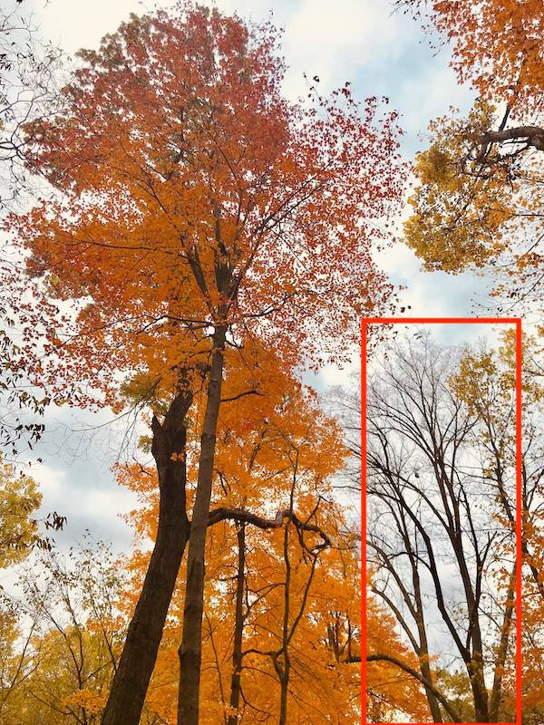|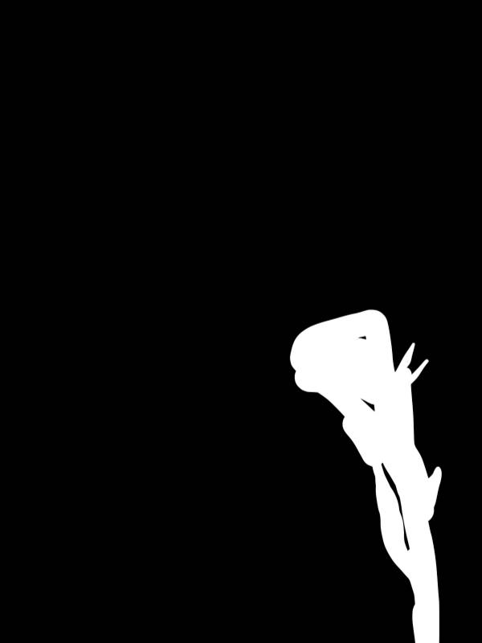|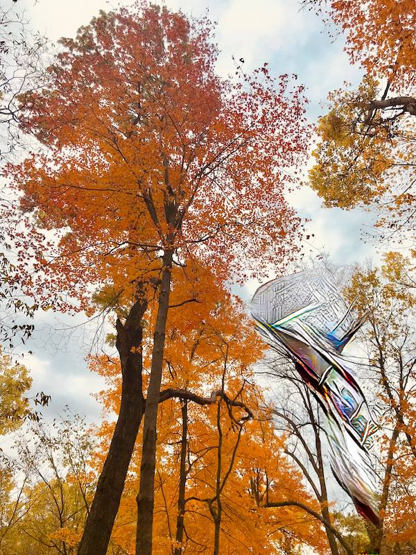|
|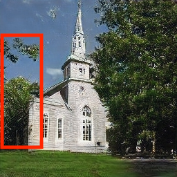|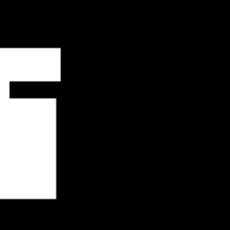|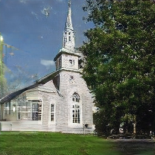|

左中右排分別是source，mask跟output。source中標出的紅框就是我們想要去除的部份。

首先我們先試了三張圖。第一張圖的樹是在畫面中間，上面是天空，右手邊有一棵樹，但不算很貼近。可以看到結果裡，上半部消除的還不錯，但是下半部樹幹的部分看起來很雜亂，不合理。我們想也許是因為mask是正方形，框的範圍太大不夠精確，於是就有了第二張圖。第二張圖的樹在樹叢中間，但是是一棵沒有葉子的樹。這邊的mask是用筆刷塗，想說是不是圖的輪廓乾淨一點，他可以判斷的比較好。但是結果是，中間多出了比第一張更明顯的雜訊。於是我們又嘗試了第三張，是在第一部分ganPaint時用過的圖，如果背景不是天空而是房子，去除的效果如何。結果圖中，它有意圖延伸屋頂的邊緣線，但是仔細看屋頂的線條其實是錯的，角度不對也不是直的，而且房子的紋理也與原本相差甚遠，但是比上兩張還好一些。以上觀察的結論是，第一張與第二張的效果（尤其是第二張）都不甚理想。

我覺得他的效果與paper中宣稱的相差甚遠，由於我的前兩張圖是用大約800x600左右的圖，我認為可能是他在圖的downsampling與upsampling方面有資訊的喪失，所以才會造成結果裡不自然的部分，所以我將前兩張圖手動縮小成320x240左右又做了一次，並比較結果。

**實驗二：大小圖比較**

|Larger Image(about 800x600)|Smaller Image(about 320x240)|
|:---:|:---:|
||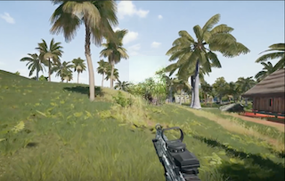|
||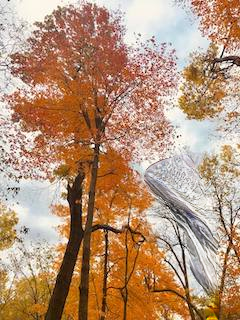|

可以看出第一張圖的結果變得自然很多，所以尺寸是有影響的。而第二張效果依舊不好，我想第二張是因為附近圈選沒有消除的部分是樹枝，讓Network誤以為那是背景，所以在填的時候才會造成這種雜訊。所以這個方法對mask中的區域背景還是沒有辦法學得很精準，例如，它無法判斷樹枝背後的天空才是背景，而不是旁邊的樹枝是背景。不過這也合理，因為他是與附近的pixel比較一致性。

總的來說，對於樹的移除方面，我們認為他的效果在移除背景單一、且獨自存在的樹，而且要是小圖，才能較為自然。背景單一是由於network在discriminator的設計所致（local discriminator與鄰近pixel比較），小圖是因為downsampling、upsampling的資料遺失。況且，這個pre-trained model是用place2 dataset train的，裡面的圖片其實是包含很多不同的地點，包含室內外都有，所以其實並不是專注在樹的景象上。

所以，我們又做了兩個圖實驗，以證明以上的觀點，見下圖。

**實驗三：小圖中獨自存在的樹較小vs小圖中獨自存在的樹較大**

|Source Image|Mask Image|Output Image|
|:---:|:---:|:---:|
|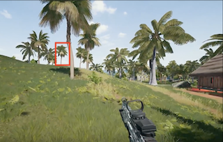|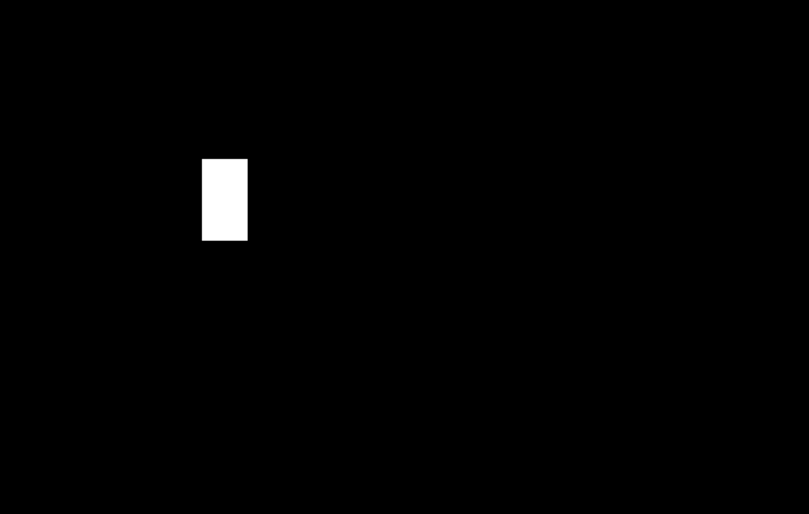|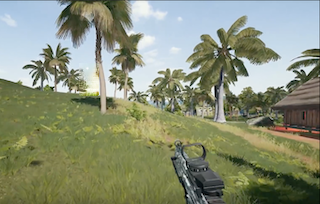|
|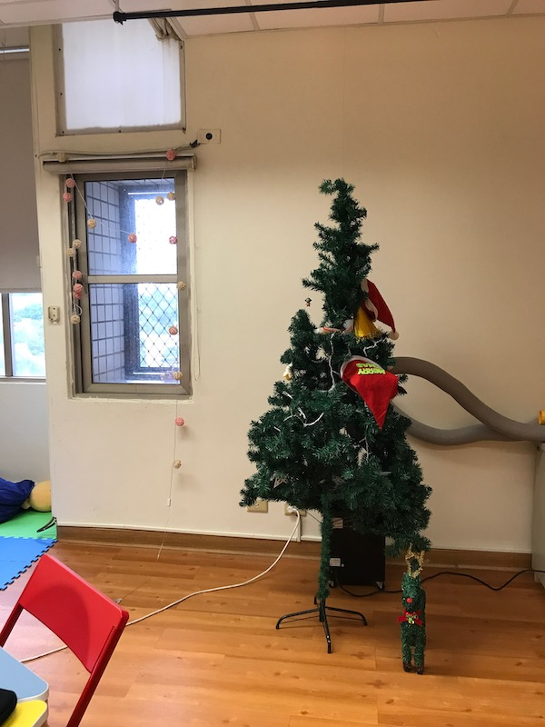|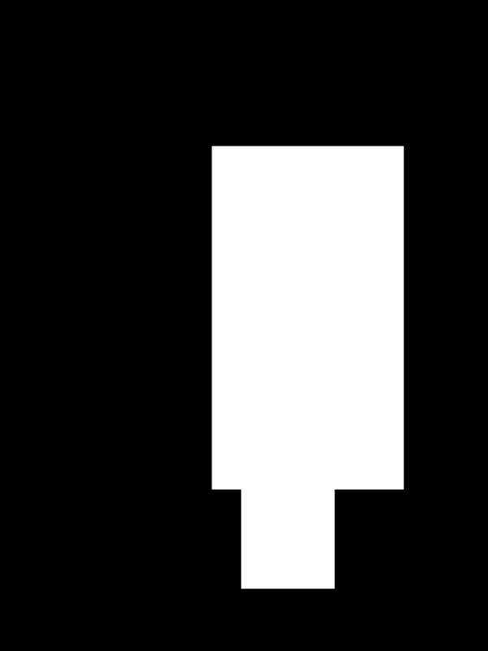|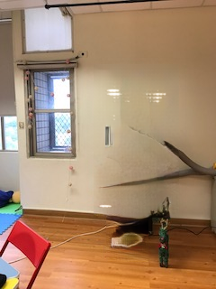|

第一張的移除效果就還滿好的，幾乎看不出之前有一棵樹。第二張沒那麼好，但是地板跟牆壁的交接處有分辨出分隔，而且還自動幫抽風機的管子填上了（儘管是填樹枝的形狀），所以我們認為還可以接受，因為樹的範圍較大，背景（牆壁）卻很單一，不怎麼能提供足夠的填補資訊，所以才還是有頗多雜訊。

## Method 2：Image Inpainting for Irregular Holes Using Partial Convolutions

### 原理說明

#### 目標

由於現存利用深度學習做Image Inpainting的方式，通常會造成結果圖的顏色差異與模糊，因此還會再加上一些post-processing，但這樣一來不僅更耗時耗資源，失敗的可能性也很大。因此這篇論文提出一種使用部分卷積(Partial convolution)的改善方法，部分卷積是指卷積只在圖片的有效像素上作用，且圖片的mask會隨著layer做更新，也就是在訓練的過程中，帶有mask的圖片和mask都會一直用到。

#### 作法

這裡說明Partial Convolutional Layer的設計、mask更新的作法、整體模型的架構以及Loss function。

**1.Partial Convolutional Layer**

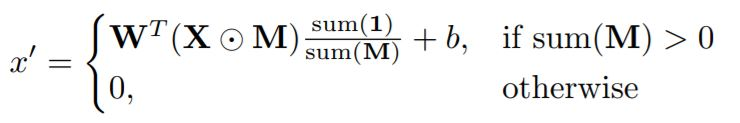

圖中W为Convolution filter weight，b是偏差，X是當下的圖片，M是mask，可以看到output值只受到沒有被mask的地方影響。

**2.Mask更新的作法**

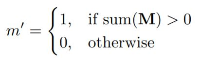

mask值的改變是用來標記有效區，只要輸入的卷積可以在至少一個有效值上調整其output，則標記為有效。

**3.整體模型的架構**

類似於UNet，但將所有的Convolutional layer都改成Partial convolutional layer，以及在Decoding階段使用Nearest Neighbor Up-sampling。

**4.Loss function**

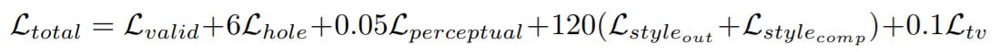

模型的Loss function(L_total)是由各種loss function依不同權重組合而成，少了任何一個都會對結果圖造成不良影響，例如少了style loss會造成魚鱗狀的artifacts、少了perceptual loss會造成網格狀的artifacts。

### 結果

在NVIDIA的AI Playground可以線上即時測試結果。
https://www.nvidia.com/research/inpainting/

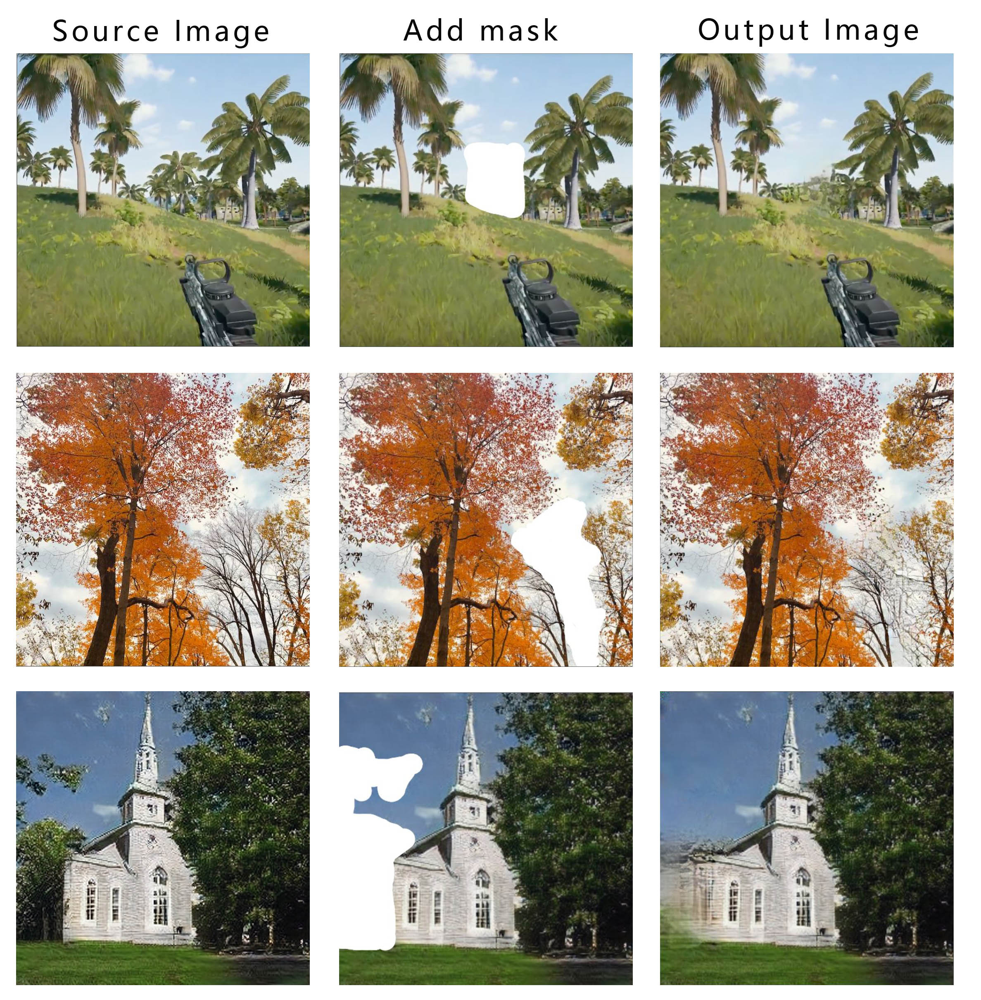

中間那排圖中純白色的位置就是mask，也就是我們想要去除的部份(與method 1 相同)。

我們用跟 method 1 一樣的圖來進行測試。從第一張圖的結果可以看見，有mask掉的地方上半部變成天空，下半部看起來像是延伸到遠方的草地，感覺都滿自然的。但是第二張圖有mask掉的地方左右都還是樹，因此結果圖又長出一些像是稀疏樹枝的東西，沒有變成原本希望的天空。而在第三張圖，mask掉的上半部有準確地變成天空，效果不錯，但是下半部變成房子的延伸，有些雜訊不太真實。

所以在這種方法上對於樹的移除，我們認為跟樹的附近是什麼東西有非常大的關係，因為它會用附近的內容來填補被mask掉的地方。仿照第一種方法又用了兩張圖實驗(第2和第3張圖是一樣的，只有mask不同)，如下圖。

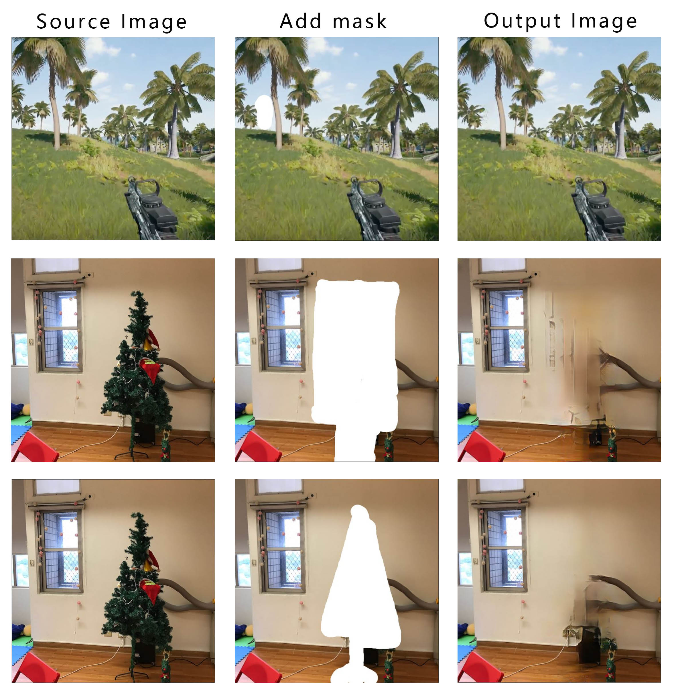

第一張圖結果滿好的，可看見mask掉的地方全部變成乾淨的天空。第二張使用跟 method 1 一樣的mask範圍後，可以看見地板和牆壁的交接處分隔仍然滿明顯，但牆上出現很明顯的雜訊。第三張改變了mask的範圍，專注於有樹的部分，結果就可以看見除了維持明顯的交接處外，牆壁也變得乾淨許多，我們覺得這是因為樹的左右保留的牆壁部分較第二張多，因此在牆壁的填補上效果較好。

## Overall comparison and conclusion

以下我們分為幾個面向討論：

|面向\方法|GANPaint|Pytorch Inpainting|Partial Convolutions|
|:---:|:---:|:---:|:---:|
|優點|GANPaint的GUI對使用者很友善|1.可以填補各式不同風格的圖（儘管我們只專注在移除樹） 2. 洞可以不只一個|只要mask周圍的圖較單純變動量少(如天空或牆壁)，即使mask掉的範圍大，填補的結果也能很好，不容易看出破綻。|
|缺點|GUI並沒有上傳圖片的功能，因此只能用網站上提供的影像做實驗。|1. 背景與mask受限，欲填補的區域要與附近內容相似 2.圖不可太大|若mask周圍的圖變化大，會有明顯的雜訊|
|實驗結果|||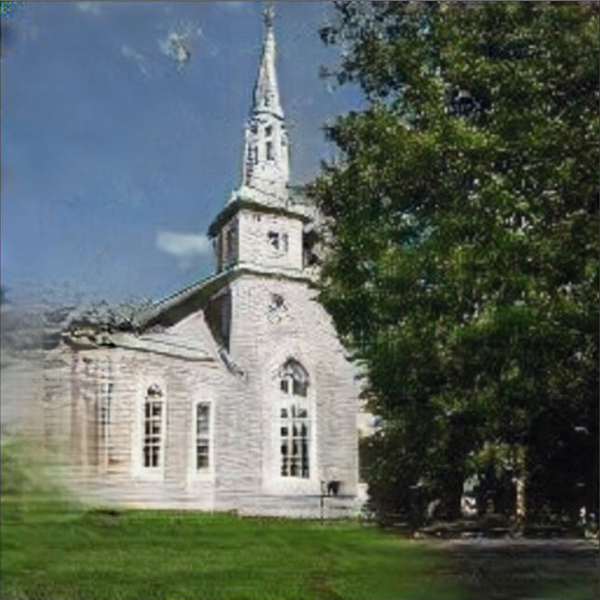|
|實驗圖討論|1. 幾乎觀察不到樹的痕跡，推測是因為這個GAN學到了教堂附近樹並不是必要因此，不會想要補樹。2. 屋簷有不合常理的突起，推測是因為model只有學到屋簷的材質跟屋頂的形狀，屋簷該是平滑的這件事並沒有學到。考量跟屋簷有關的feature map中並沒有indicate說這個地方會有屋簷，是model學到這裡該補屋簷所以才補上來的，generate出這種影像是挺合理的。|1. 圖中的樹並沒有完全被抹除，而天空中髒髒的痕跡是三者中最多。推測是local discriminator 128x128的mask看到的區域中額外的訊息太多反而導致雜訊產生。 2. 有嘗試填補屋頂與房屋外牆，但是不自然。推測是因為這個model並不是學到這些空白區域（如這個例子是房屋的外牆）應該長什麼樣子，而是生成與旁邊的pixel相似的質地，所以它產生一些類似窗框的形狀，但由於不知道真正自然的影像應該是如何，所以才會變成這種重疊的不自然痕跡。|在mask掉的樹中，上半部的樹由於周圍是天空(圖較單純)，因此填補的效果較其他兩種方法好，很擬真也沒雜訊，但是下半部由於周圍是房子(圖的變動量較大也較複雜)，因此雖然有試著做出房子的延伸，但仍可看出明顯的雜訊，較不真實。|
